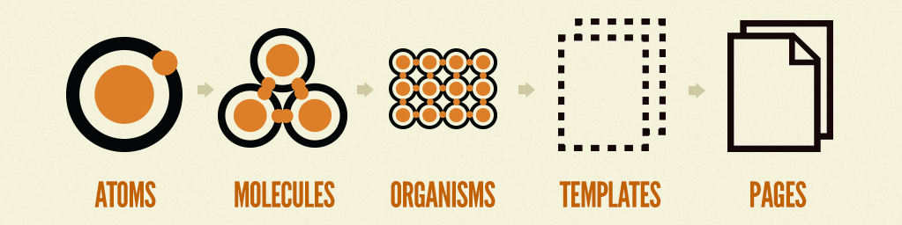

# Finsphere

Web application for Finsphere

## Prerequisites
- [Node.js](https://nodejs.org/en/download/) >= 22
- [ECMA Script 16](https://ecma-international.org/publications-and-standards/standards/ecma-262/) >= 2025

## Run Application

Installing dependencies

```sh
npm install
```

## Developing

Run `npm start` to start a server and open the app and storybook in a new browser tab.

If only running svelte

```sh
npm run dev

# or start the server and open the app in a new browser tab
npm run dev -- --open
```

## Deployment

To create a production version of your app:

```sh
npm run build
```

Static files will go to deployment on the `dist` directory.

You can preview the production build with `npm run preview`.

> To deploy your app, you may need to install an [adapter](https://svelte.dev/docs/kit/adapters) for your target environment.

## Achitecture

This application use architecture [Sveltekit](https://svelte.dev/docs/kit/introduction) Singla Page Application (SPA/CSR) & [Svelte Library](https://svelte.dev/docs/svelte/overview). If you want to know more about this architecture, you can read the notes. 

### Notes & Reference

- [Pilih CSR (Client Side Render) atau SSR (Server Side Render) Untk Website](https://feri-irawansyah.my.id/catatan/frontend/pilih-csr-client-side-render-atau-server-side-render-untuk-frontend).
- [Sveltekit Frmework Untuk Svelte Library Tanpa Drama - Dramaan](https://feri-irawansyah.my.id/catatan/fullstack/sveltekit-framework-untuk-svelte-library-tanpa-drama-dramaan).
- [Catatan Ringan Ini Tentang Svelte Frontend Library Yang Minimalis](https://feri-irawansyah.my.id/catatan/frontend/catatan-ringan-ini-tentang-svelte-frontend-framework-yang-minimalis)

### Methodology

This application use [Atomic Design](https://atomicdesign.bradfrost.com/table-of-contents) methodology.



### Dependencies

- [Sveltekit](https://svelte.dev/docs/kit/introduction) - framework
- [Svelte](https://svelte.dev/) - library
- [Vite](https://vitejs.dev/) - build tools
- [Bootstrap](https://getbootstrap.com/) - css framework
- [Bootstrap Icons](https://icons.getbootstrap.com/) - icon
- [Sass](https://sass-lang.com) - css preprocessor
- [Sweetalert2](https://sweetalert2.github.io/) - notification
- [Apexcharts](https://apexcharts.com/) - charting library
- [Ag Grid](https://www.ag-grid.com/) - data grid
- [Svelte Select](https://svelte-select-examples.vercel.app/examples) - select dropdown component